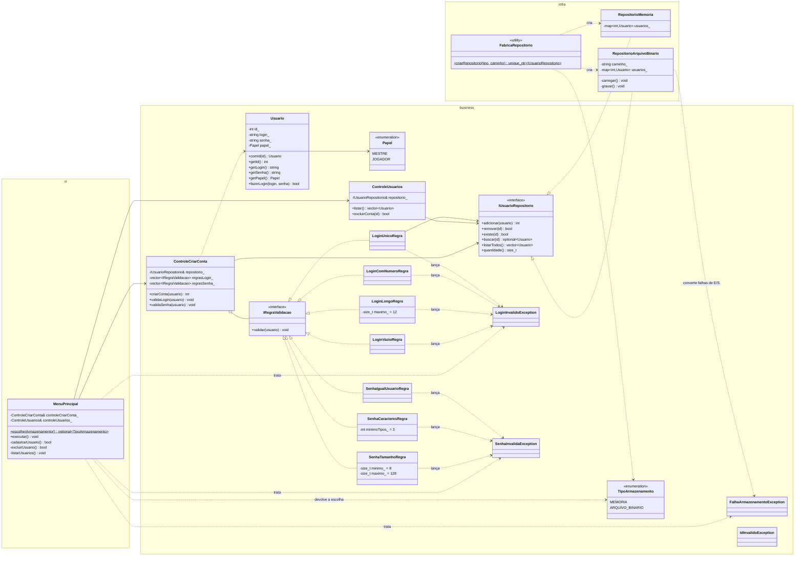
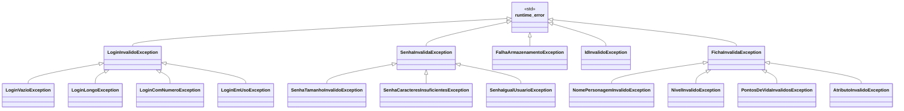

# Projeto detalhado — pacotes, classes de projeto e padrões

> O **diagrama de classes de projeto** evolui a cada sprint, diferente do diagrama de **análise** (`05-analise.md`), que é conceitual e muda pouco.
> Atualize este arquivo em **toda** sprint (ver [cronograma](00-entregas.md)).

## 1. Divisão de pacotes

```text
src/
├── main.cpp                  ← raiz de composição: cria os repositórios escolhidos (`escolherFabrica(tipo)->criarRepositorios()`), inicializa a fachada e abre o menu
├── ui/                       ← fronteira: MenuPrincipal, MenuPersonagens, Console (leitura do teclado)
├── business/
│   ├── model/                ← entidades: Usuario, Papel, Personagem, Ficha (com Atributos)
│   ├── control/              ← FacadeSingletonController (fachada única) e os controles ControleCriarConta (UC01), ControleUsuarios (UC03, UC04), ControlePersonagem (UC07, UC12–UC14)
│   ├── validation/           ← IRegraValidacao (login e senha) e IRegraFicha (ficha do personagem)
│   ├── exception/            ← exceções de negócio: Login/Senha/FichaInvalida, IdInvalidoException, FalhaArmazenamentoException
│   └── repository/           ← interfaces IUsuarioRepositorio e IPersonagemRepositorio, FabricaRepositorio (Creator do Factory Method), enum TipoArmazenamento
└── infra/                    ← repositórios em memória e em arquivo binário, ArquivoBinario, fábricas concretas (FabricaMemoria, FabricaArquivoBinario) e EscolhaFabrica
test/                         ← um teste por cenário das regras (make test)
```

**Regra de dependência:** `ui` → `business` ← `infra`. A `ui` só conhece a `FacadeSingletonController` (ver [ADR-0004](07-arquitetura/adr/0004-fachada-singleton.md)). A camada `business` não inclui nada de `ui` nem de `infra`; ela conhece só a interface `IUsuarioRepositorio`, e `infra` a implementa. Só o `main.cpp` (raiz de composição) conhece as três camadas e liga a escolha da `ui` à fábrica da `infra` (`escolherFabrica`) (ver [ADR-0001](07-arquitetura/adr/0001-persistencia-substituivel.md)).

## 2. Diagrama de classes de projeto

### Estado atual: Sprint 3 (S3.1)

Nova entidade **Personagem** (Usuário 1 → * Personagem) com CRUD completo e a fachada única **FacadeSingletonController** (Facade + Singleton) para os controles, com `obterQuantidadeEntidades()`. Os IDs de usuário e de personagem são gerados pelos repositórios ([ADR-0003](07-arquitetura/adr/0003-id-automatico.md)). Para não repetir o diagrama da Sprint 2, as regras de login e senha aparecem só pela interface `IRegraValidacao`.


```mermaid
classDiagram
    direction LR

    namespace ui {
        class MenuPrincipal {
            -FacadeSingletonController& fachada_
            +escolherArmazenamento()$ optional~TipoArmazenamento~
            +executar() void
        }
        class MenuPersonagens {
            -FacadeSingletonController& fachada_
            +executar() bool
            -lerFicha()$ optional~Ficha~
        }
    }

    namespace business {
        class FacadeSingletonController {
            <<singleton>>
            -unique_ptr~ControleCriarConta~ controleCriarConta_
            -unique_ptr~ControleUsuarios~ controleUsuarios_
            -unique_ptr~ControlePersonagem~ controlePersonagem_
            -FacadeSingletonController()
            +getInstancia()$ FacadeSingletonController&
            +inicializar(usuarios, personagens) void
            +criarConta(usuario) int
            +listarUsuarios() vector~Usuario~
            +excluirUsuario(id) bool
            +criarPersonagem(personagem) int
            +editarPersonagem(id, ficha) void
            +excluirPersonagem(id) bool
            +buscarPersonagem(id) optional~Personagem~
            +listarPersonagens() vector~Personagem~
            +obterQuantidadeUsuarios() size_t
            +obterQuantidadePersonagens() size_t
            +obterQuantidadeEntidades() size_t
        }
        class ControleCriarConta {
            +criarConta(usuario) int
        }
        class ControleUsuarios {
            +listar() vector~Usuario~
            +excluirConta(id) bool
            +quantidade() size_t
        }
        class ControlePersonagem {
            -vector~IRegraFicha~ regrasFicha_
            +criar(personagem) int
            +editarFicha(id, ficha) void
            +excluir(id) bool
            +excluirDoDono(idDono) size_t
            +buscar(id) optional~Personagem~
            +listar() vector~Personagem~
            +quantidade() size_t
        }
        class Usuario {
            -int id_
            -string login_
            -string senha_
            -Papel papel_
            +comId(id) Usuario
        }
        class Personagem {
            -int id_
            -int idDono_
            -Ficha ficha_
            +comId(id) Personagem
            +comFicha(ficha) Personagem
            +getFicha() Ficha
        }
        class Ficha {
            <<struct>>
            +string nome
            +int nivel
            +int pontosDeVida
            +Atributos atributos
        }
        class Atributos {
            <<struct>>
            +int forca, destreza, constituicao
            +int inteligencia, sabedoria, carisma
        }
        class IUsuarioRepositorio {
            <<interface>>
            +adicionar(usuario) int
            +remover(id) bool
            +existe(id) bool
            +buscar(id) optional~Usuario~
            +listarTodos() vector~Usuario~
            +quantidade() size_t
        }
        class IPersonagemRepositorio {
            <<interface>>
            +adicionar(personagem) int
            +atualizar(personagem) bool
            +remover(id) bool
            +buscar(id) optional~Personagem~
            +listarTodos() vector~Personagem~
            +quantidade() size_t
        }
        class FabricaRepositorio {
            <<abstract, Creator>>
            +criarRepositorioUsuarios()* unique_ptr~IUsuarioRepositorio~
            +criarRepositorioPersonagens()* unique_ptr~IPersonagemRepositorio~
            +tipo()* TipoArmazenamento
            +criarRepositorios() Repositorios
        }
        class IRegraValidacao {
            <<interface>>
            +validar(usuario) void
        }
        class IRegraFicha {
            <<interface>>
            +validar(ficha) void
        }
        class NomePersonagemRegra
        class NivelRegra
        class PontosDeVidaRegra
        class AtributosRegra
    }

    namespace infra {
        class RepositorioMemoria
        class RepositorioArquivoBinario
        class RepositorioPersonagemMemoria {
            #Estado estado_
        }
        class RepositorioPersonagemArquivoBinario {
            -string caminho_
            -persistirOuDesfazer(anterior) void
        }
        class ArquivoBinario {
            <<utility>>
            +carregar(caminho, ler)$ bool
            +gravar(caminho, escrever)$ void
        }
        class FabricaMemoria {
            +criarRepositorioUsuarios() unique_ptr~IUsuarioRepositorio~
            +criarRepositorioPersonagens() unique_ptr~IPersonagemRepositorio~
            +tipo() TipoArmazenamento
        }
        class FabricaArquivoBinario {
            -string caminhoUsuarios_
            -string caminhoPersonagens_
            +criarRepositorioUsuarios() unique_ptr~IUsuarioRepositorio~
            +criarRepositorioPersonagens() unique_ptr~IPersonagemRepositorio~
            +tipo() TipoArmazenamento
        }
        class EscolhaFabrica {
            <<utility>>
            +escolherFabrica(tipo)$ unique_ptr~FabricaRepositorio~
        }
    }

    MenuPrincipal --> FacadeSingletonController
    MenuPersonagens --> FacadeSingletonController
    MenuPrincipal ..> MenuPersonagens : abre
    FacadeSingletonController *-- ControleCriarConta
    FacadeSingletonController *-- ControleUsuarios
    FacadeSingletonController *-- ControlePersonagem
    ControleCriarConta --> IUsuarioRepositorio
    ControleCriarConta o-- IRegraValidacao
    ControleUsuarios --> IUsuarioRepositorio
    ControlePersonagem --> IPersonagemRepositorio
    ControlePersonagem --> IUsuarioRepositorio : verifica o dono
    ControlePersonagem o-- IRegraFicha
    IRegraFicha <|.. NomePersonagemRegra
    IRegraFicha <|.. NivelRegra
    IRegraFicha <|.. PontosDeVidaRegra
    IRegraFicha <|.. AtributosRegra
    Usuario "1" <-- "*" Personagem : idDono
    Personagem *-- Ficha
    Ficha *-- Atributos
    IUsuarioRepositorio <|.. RepositorioMemoria
    IUsuarioRepositorio <|.. RepositorioArquivoBinario
    IPersonagemRepositorio <|.. RepositorioPersonagemMemoria
    RepositorioPersonagemMemoria <|-- RepositorioPersonagemArquivoBinario
    RepositorioArquivoBinario ..> ArquivoBinario
    RepositorioPersonagemArquivoBinario ..> ArquivoBinario
    FabricaRepositorio <|-- FabricaMemoria
    FabricaRepositorio <|-- FabricaArquivoBinario
    FabricaRepositorio ..> IUsuarioRepositorio : factory method
    FabricaRepositorio ..> IPersonagemRepositorio : factory method
    FabricaMemoria ..> RepositorioMemoria : cria
    FabricaMemoria ..> RepositorioPersonagemMemoria : cria
    FabricaArquivoBinario ..> RepositorioArquivoBinario : cria
    FabricaArquivoBinario ..> RepositorioPersonagemArquivoBinario : cria
    EscolhaFabrica ..> FabricaRepositorio : devolve
```

> O diagrama completo da Sprint 4 (S4.1), com a entidade de acessos, o Adapter e o Template Method, será redesenhado quando esses itens forem implementados.

### Sprints 1 e 2 (S2.1)

Validação dos campos com exceções e dois mecanismos de armazenamento (memória e arquivo binário).


```mermaid
classDiagram
    direction LR

    namespace ui {
        class MenuPrincipal {
            -ControleCriarConta& controleCriarConta_
            -ControleUsuarios& controleUsuarios_
            +escolherArmazenamento()$ optional~TipoArmazenamento~
            +executar() void
            -cadastrarUsuario() bool
            -excluirUsuario() bool
            -listarUsuarios() void
        }
    }

    namespace business {
        class Usuario {
            -int id_
            -string login_
            -string senha_
            -Papel papel_
            +comId(id) Usuario
            +getId() int
            +getLogin() string
            +getSenha() string
            +getPapel() Papel
            +fazerLogin(login, senha) bool
        }
        class Papel {
            <<enumeration>>
            MESTRE
            JOGADOR
        }
        class TipoArmazenamento {
            <<enumeration>>
            MEMORIA
            ARQUIVO_BINARIO
        }
        class ControleCriarConta {
            -IUsuarioRepositorio& repositorio_
            -vector~IRegraValidacao~ regrasLogin_
            -vector~IRegraValidacao~ regrasSenha_
            +criarConta(usuario) int
            +validaLogin(usuario) void
            +validaSenha(usuario) void
        }
        class ControleUsuarios {
            -IUsuarioRepositorio& repositorio_
            +listar() vector~Usuario~
            +excluirConta(id) bool
        }
        class IUsuarioRepositorio {
            <<interface>>
            +adicionar(usuario) int
            +remover(id) bool
            +existe(id) bool
            +buscar(id) optional~Usuario~
            +listarTodos() vector~Usuario~
            +quantidade() size_t
        }
        class IRegraValidacao {
            <<interface>>
            +validar(usuario) void
        }
        class LoginVazioRegra
        class LoginLongoRegra {
            -size_t maximo_ = 12
        }
        class LoginComNumeroRegra
        class LoginUnicoRegra
        class SenhaTamanhoRegra {
            -size_t minimo_ = 8
            -size_t maximo_ = 128
        }
        class SenhaCaracteresRegra {
            -int minimoTipos_ = 3
        }
        class SenhaIgualUsuarioRegra
        class LoginInvalidoException
        class SenhaInvalidaException
        class FalhaArmazenamentoException
        class IdInvalidoException
    }

    namespace infra {
        class RepositorioMemoria {
            -map~int,Usuario~ usuarios_
        }
        class RepositorioArquivoBinario {
            -string caminho_
            -map~int,Usuario~ usuarios_
            -carregar() void
            -gravar() void
        }
        class FabricaRepositorio {
            <<utility>>
            +criarRepositorio(tipo, caminho)$ unique_ptr~IUsuarioRepositorio~
        }
    }

    MenuPrincipal --> ControleCriarConta
    MenuPrincipal --> ControleUsuarios
    MenuPrincipal ..> TipoArmazenamento : devolve a escolha
    FabricaRepositorio ..> TipoArmazenamento
    MenuPrincipal ..> LoginInvalidoException : trata
    MenuPrincipal ..> SenhaInvalidaException : trata
    MenuPrincipal ..> FalhaArmazenamentoException : trata
    ControleCriarConta --> IUsuarioRepositorio
    ControleCriarConta o-- IRegraValidacao
    ControleCriarConta ..> Usuario
    ControleUsuarios --> IUsuarioRepositorio
    Usuario --> Papel

    IRegraValidacao <|.. LoginVazioRegra
    IRegraValidacao <|.. LoginLongoRegra
    IRegraValidacao <|.. LoginComNumeroRegra
    IRegraValidacao <|.. LoginUnicoRegra
    IRegraValidacao <|.. SenhaTamanhoRegra
    IRegraValidacao <|.. SenhaCaracteresRegra
    IRegraValidacao <|.. SenhaIgualUsuarioRegra
    LoginUnicoRegra --> IUsuarioRepositorio

    LoginVazioRegra ..> LoginInvalidoException : lança
    LoginLongoRegra ..> LoginInvalidoException : lança
    LoginComNumeroRegra ..> LoginInvalidoException : lança
    LoginUnicoRegra ..> LoginInvalidoException : lança
    SenhaTamanhoRegra ..> SenhaInvalidaException : lança
    SenhaCaracteresRegra ..> SenhaInvalidaException : lança
    SenhaIgualUsuarioRegra ..> SenhaInvalidaException : lança

    IUsuarioRepositorio <|.. RepositorioMemoria
    IUsuarioRepositorio <|.. RepositorioArquivoBinario
    FabricaRepositorio ..> RepositorioMemoria : cria
    FabricaRepositorio ..> RepositorioArquivoBinario : cria
    RepositorioArquivoBinario ..> FalhaArmazenamentoException : converte falhas de E/S
```

Versão em imagem: [`diagramas/DiagramaClasses-projeto.png`](diagramas/DiagramaClasses-projeto.png).

### Hierarquia de exceções

Cada regra lança uma subclasse específica, e a interface trata pelas classes-base. Todas as exceções de negócio derivam de `std::runtime_error` (condição do ambiente ou dado do usuário, que pode ser contornada em tempo de execução), e não de `std::logic_error`, reservada a erros de programação. C++ não tem `IOException`: os erros de E/S do arquivo (`std::ios_base::failure`, arquivo truncado ou corrompido) são convertidos em `FalhaArmazenamentoException`.


```mermaid
classDiagram
    direction TB
    class runtime_error { <<std>> }
    runtime_error <|-- LoginInvalidoException
    runtime_error <|-- SenhaInvalidaException
    runtime_error <|-- FalhaArmazenamentoException
    runtime_error <|-- IdInvalidoException
    runtime_error <|-- FichaInvalidaException
    FichaInvalidaException <|-- NomePersonagemInvalidoException
    FichaInvalidaException <|-- NivelInvalidoException
    FichaInvalidaException <|-- PontosDeVidaInvalidosException
    FichaInvalidaException <|-- AtributoInvalidoException
    LoginInvalidoException <|-- LoginVazioException
    LoginInvalidoException <|-- LoginLongoException
    LoginInvalidoException <|-- LoginComNumeroException
    LoginInvalidoException <|-- LoginEmUsoException
    SenhaInvalidaException <|-- SenhaTamanhoInvalidoException
    SenhaInvalidaException <|-- SenhaCaracteresInsuficientesException
    SenhaInvalidaException <|-- SenhaIgualUsuarioException
```

| Exceção | Regra (requisito) | Mensagem |
|---|---|---|
| LoginVazioException | RF02 | O login nao pode ser vazio. |
| LoginLongoException | RF02 | O login deve ter no maximo 12 caracteres. |
| LoginComNumeroException | RF02 | O login nao pode conter numeros. |
| LoginEmUsoException | RF01 | Login ja esta em uso. |
| SenhaTamanhoInvalidoException | RF03 | A senha deve ter entre 8 e 128 caracteres. |
| SenhaCaracteresInsuficientesException | RF03 | A senha deve conter ao menos 3 dos 4 tipos: maiusculas, minusculas, numeros e especiais. |
| SenhaIgualUsuarioException | RF03 | A senha nao pode ser igual ao login. |
| IdInvalidoException | RF08, RF10 | Nao existe usuario com esse ID para ser o dono. / Nao existe personagem com esse ID. |
| NomePersonagemInvalidoException | RF08, RF10 | O nome do personagem deve ter de 1 a 30 caracteres. |
| NivelInvalidoException | RF08, RF10 | O nivel deve estar entre 1 e 20. |
| PontosDeVidaInvalidosException | RF08, RF10 | Os pontos de vida devem ser maiores que zero. |
| AtributoInvalidoException | RF08, RF10 | O atributo &lt;nome&gt; deve estar entre 1 e 30. |
| FalhaArmazenamentoException | NF-CON-01, NF-CON-02 | Descreve a falha do arquivo, sem dados do usuário |

### Formato dos arquivos binários

Inteiros de tamanho fixo, little-endian (NF-POR-02): `int32` próximo ID a ser atribuído (ADR-0003), `uint32` quantidade de usuários; para cada usuário, `int32` ID, `uint32` tamanho + bytes do login, `uint32` tamanho + bytes da senha, `uint8` papel (1 = Mestre, 2 = Jogador). 

`personagens.dat`: `int32` próximo ID, `uint32` quantidade; para cada personagem, `int32` ID, `int32` ID do dono, `uint32` tamanho + bytes do nome, e oito `int32`: nível, pontos de vida, Força, Destreza, Constituição, Inteligência, Sabedoria e Carisma.

Nos dois arquivos, a gravação é feita num arquivo temporário (`.tmp`) que depois substitui o original; se falhar, a alteração é desfeita também em memória. A leitura e a gravação ficam no módulo `infra/ArquivoBinario`, usado pelos dois repositórios em arquivo.

## 3. Princípios SOLID aplicados

| Princípio | Onde aparece |
|---|---|
| **S** Responsabilidade única | Um controle por grupo de casos de uso (`ControleCriarConta` UC01, `ControleUsuarios` UC03/UC04, `ControlePersonagem` UC07/UC12–UC14); a fachada só repassa e coordena; cada regra de validação é uma classe; a E/S binária fica em `ArquivoBinario`; a leitura do teclado fica em `ui/Console` |
| **O** Aberto/fechado | Nova regra = nova classe que implementa `IRegraValidacao` ou `IRegraFicha`; novo armazenamento = nova classe que implementa a interface do repositório (NF-MAN-01, NF-MAN-02) |
| **L** Substituição de Liskov | Os repositórios em memória e em arquivo cumprem o mesmo contrato; `RepositorioPersonagemArquivoBinario` estende a versão em memória sem mudar o comportamento esperado, só acrescentando a gravação |
| **I** Segregação de interfaces | `IRegraValidacao` e `IRegraFicha` têm um único método; a regra de ficha não depende de `Usuario` |
| **D** Inversão de dependência | Os controles dependem das interfaces de repositório, recebidas no construtor; a `ui` depende da fachada recebida no construtor; só `main.cpp` conhece as classes concretas de `infra` |

## 4. Padrões de projeto utilizados

| Padrão | Sprint | Classes participantes (papel no padrão) | Problema que resolve no projeto | ADR |
|---|---|---|---|---|
| Strategy (regras de validação) | S2, S3 | IRegraValidacao e IRegraFicha (estratégias), regras de login, senha e ficha (estratégias concretas), ControleCriarConta e ControlePersonagem (contextos) | Acrescentar regras sem alterar as existentes (NF-MAN-02) | — |
| Injeção de dependência | S2 | ControleCriarConta recebe IUsuarioRepositorio no construtor | Trocar o armazenamento sem alterar o controle (NF-MAN-01) | [ADR-0001](07-arquitetura/adr/0001-persistencia-substituivel.md) |
| Singleton | S3 | FacadeSingletonController (construtor privado, `getInstancia()` com `static` local, cópia proibida) | Uma única fachada para toda a aplicação, inicializada uma vez em `main.cpp` | [ADR-0004](07-arquitetura/adr/0004-fachada-singleton.md) |
| Facade | S3 | FacadeSingletonController (fachada); ControleCriarConta, ControleUsuarios, ControlePersonagem (subsistema); MenuPrincipal, MenuPersonagens (clientes) | A `ui` usa um único ponto de entrada; operações entre entidades (exclusão em cascata, contagem de entidades) ficam no negócio | [ADR-0004](07-arquitetura/adr/0004-fachada-singleton.md) |
| Repository | S4 | Interfaces IUsuarioRepositorio e IPersonagemRepositorio na business (só tipos do domínio); implementações em memória e em arquivo binário na infra | A business trata os dados como uma coleção em memória, sem saber onde ficam; regras de negócio ficam nos controles; os testes usam a versão em memória | [ADR-0005](07-arquitetura/adr/0005-repository-e-factory-method.md) |
| Factory Method | S4 | FabricaRepositorio (Creator abstrato, na business; declara os factory methods `criarRepositorioUsuarios()` e `criarRepositorioPersonagens()`), FabricaMemoria e FabricaArquivoBinario (Creators concretos, na infra, decidem a classe instanciada), IUsuarioRepositorio e IPersonagemRepositorio (produtos), `escolherFabrica()` (seleciona o Creator a partir de TipoArmazenamento) | Escolher o tipo de repositório (RF05) sem `if` espalhado e sem que a business conheça classes da infra; novo mecanismo = nova subclasse (NF-MAN-01) | [ADR-0005](07-arquitetura/adr/0005-repository-e-factory-method.md) |
| Adapter | S4 | ILogger (Target, na business), LogCAdapter (Adapter, na infra), biblioteca rxi/log.c em `infra/externo/logc` (Adaptee); LoggerNulo (Null Object) quando não há log | Registrar eventos em `rpg.log` com uma biblioteca C pronta sem que a business dependa dela; trocar de biblioteca = novo adaptador | [ADR-0006](07-arquitetura/adr/0006-adapter-log.md) |
| Template Method | S4 | GeradorRelatorioAcessos (classe abstrata; `gerar()` é o método-template, não virtual), RelatorioHtml (subclasse concreta), `textoRodape()` (gancho) | Gerar o relatório de acessos em mais de um formato com as mesmas seções, na mesma ordem; formato novo = nova subclasse | [ADR-0007](07-arquitetura/adr/0007-relatorios-template-method.md) |
| Command | S5 | | | |
| Memento | S5 | | | |

## 5. Rastreabilidade requisito → código → teste

Testes em `test/testes.cpp`, `test/testes_personagem.cpp`, `test/testes_fachada.cpp` e `test/testes_fabrica.cpp` (`cd src && make test`).

| Requisito | Classes | Testes | Situação |
|---|---|---|---|
| RF01 Cadastrar usuário | ControleCriarConta, LoginUnicoRegra, IUsuarioRepositorio (ID automático) | deve_recusar_login_ja_existente, deve_gerar_ids_sequenciais_a_partir_de_1, deve_ignorar_id_informado_no_cadastro, nao_deve_reaproveitar_id_de_usuario_excluido, repositorio_binario_deve_persistir_entre_instancias | Implementado |
| RF02 Regras de login | LoginVazioRegra, LoginLongoRegra, LoginComNumeroRegra | deve_recusar_login_vazio, deve_recusar_login_so_com_espacos, deve_recusar_login_com_13_caracteres, deve_aceitar_login_com_12_caracteres, deve_recusar_login_com_numeros | Implementado |
| RF03 Regras de senha | SenhaTamanhoRegra, SenhaCaracteresRegra, SenhaIgualUsuarioRegra | deve_recusar_senha_com_menos_de_8_caracteres, deve_recusar_senha_com_mais_de_128_caracteres, deve_recusar_senha_com_apenas_2_tipos_de_caractere, deve_aceitar_senha_com_3_tipos_de_caractere, deve_recusar_senha_igual_ao_login | Implementado |
| RF04 Listar usuários | ControleUsuarios, MenuPrincipal | listar_deve_retornar_os_usuarios_cadastrados, listar_sem_usuarios_deve_retornar_vazio | Implementado |
| RF05 Escolher o armazenamento | MenuPrincipal, FabricaRepositorio, FabricaMemoria, FabricaArquivoBinario, EscolhaFabrica, repositórios em memória e em arquivo | escolher_fabrica_deve_devolver_a_fabrica_do_tipo_pedido, fabrica_memoria_deve_criar_repositorios_vazios, fabrica_memoria_deve_criar_repositorios_independentes, fabrica_arquivo_deve_criar_repositorios_que_persistem, fabrica_arquivo_deve_lancar_falha_com_arquivo_corrompido, repositorio_memoria_deve_comecar_vazio, repositorio_binario_deve_persistir_entre_instancias, repositorio_personagem_binario_deve_persistir_entre_instancias | Implementado |
| RF06 Excluir usuário | ControleUsuarios, FacadeSingletonController | deve_excluir_usuario_existente, excluir_id_inexistente_deve_retornar_falso, excluir_usuario_deve_excluir_os_personagens_dele | Implementado |
| RF08 Criar personagem | ControlePersonagem, regras de ficha, IPersonagemRepositorio | deve_criar_personagem_com_id_automatico, deve_recusar_personagem_de_usuario_inexistente, deve_recusar_personagem_com_ficha_invalida, deve_recusar_nome_de_personagem_vazio, deve_recusar_nome_de_personagem_com_31_caracteres, deve_recusar_nivel_fora_de_1_a_20, deve_recusar_pontos_de_vida_zerados, deve_recusar_atributo_fora_de_1_a_30 | Implementado |
| RF09 Listar personagens | ControlePersonagem, MenuPersonagens, calcularModificador | modificador_deve_arredondar_para_baixo, repositorio_personagem_memoria_deve_fazer_crud | Implementado |
| RF10 Editar ficha | ControlePersonagem, Personagem::comFicha | deve_editar_ficha_mantendo_o_dono, deve_recusar_edicao_com_ficha_invalida_sem_alterar, editar_personagem_inexistente_deve_lancar_id_invalido, editar_ficha_deve_manter_id_e_dono | Implementado |
| RF11 Excluir personagem | ControlePersonagem | deve_excluir_personagem | Implementado |
| RF12 Quantidade de entidades | FacadeSingletonController::obterQuantidadeEntidades | fachada_deve_contar_entidades_cadastradas, fachada_deve_ser_instancia_unica | Implementado |
| RF07 Autenticar | Usuario::fazerLogin | — | Planejado (Entrega 2) |
| NF-SEG-01 Senha nunca exibida | MenuPrincipal, Excecoes.h | mensagens_de_erro_nao_devem_conter_a_senha | Implementado |
| NF-SEG-02 Falha de login sem pista | — | — | Planejado com RF07 |
| NF-MAN-01, NF-MAN-02 | IUsuarioRepositorio, IRegraValidacao | — (verificado por revisão do projeto) | Implementado |
| NF-MAN-03 Testes automatizados | test/ | 50 testes | Implementado |
| NF-CON-01, NF-CON-02, NF-CON-03 | ArquivoBinario, repositórios em arquivo, FalhaArmazenamentoException | arquivo_binario_truncado_deve_lancar_falha_armazenamento, arquivo_binario_corrompido_deve_lancar_falha_armazenamento, arquivo_de_personagens_corrompido_deve_lancar_falha_armazenamento | Implementado |
| NF-DES-01 Tempo de listagem e carga | RepositorioArquivoBinario | medição manual em 14/10/2026: carga de 10.000 usuários em ~11 ms e listagem em ~5 ms | Atendido |
| NF-USA-01, NF-USA-03 | MenuPrincipal, Excecoes.h | — (verificado executando o programa) | Implementado |
| NF-USA-02 Cadastro rápido de aprender | — | teste com usuários planejado | A medir |
| NF-POR-01, NF-POR-02 | Makefile, RepositorioArquivoBinario | compilado em Linux (g++, 0 avisos); Windows a verificar pela equipe | Parcial |
